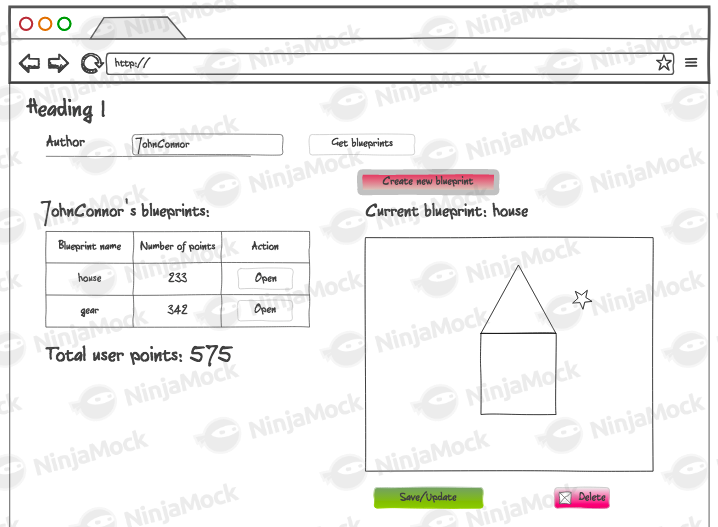
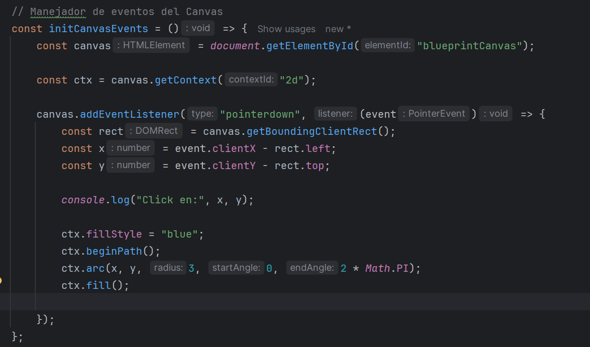
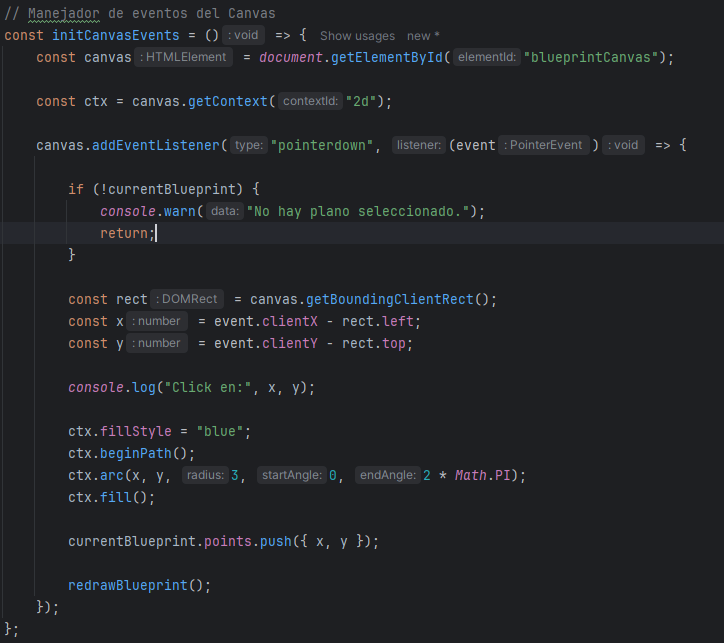
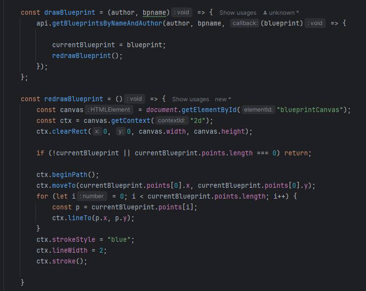
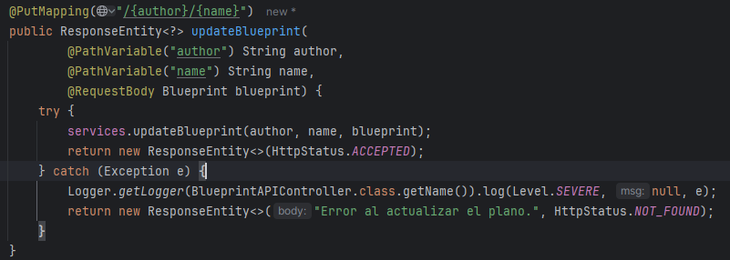
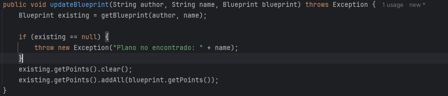
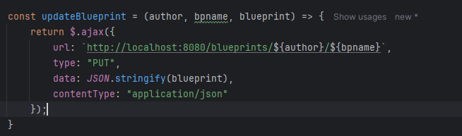
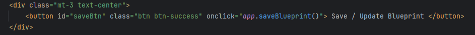
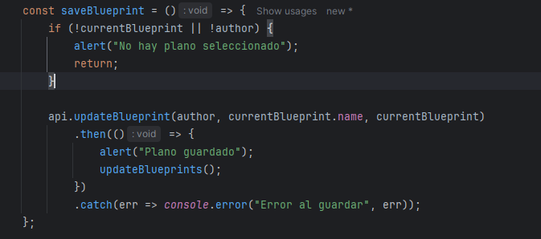

# Arquitecturas de Software (ARSW) - Laboratorio #6

## Procesos de desarrollo de software - PDSW

### Construcción de un cliente 'grueso' con un API REST, HTML5, Javascript y CSS3. Parte II

#### Nicolás Toro

[](https://www.oracle.com/java/)
[](https://maven.apache.org/)

---

En este respositorio se muestra la solución al
[Laboratorio 6](https://github.com/ARSW-ECI-archive/HTML5-JS_REST_CLIENT_Blueprints-2.git)

ESCRIBIR SOLUCIÓN

## Estructura del laboratorio

```bash
├───.idea
├───.mvn
│   └───wrapper
├───img
├───src
│   ├───main
│   │   ├───java
│   │   │   └───edu
│   │   │       └───eci
│   │   │           └───arsw
│   │   │               └───blueprints
│   │   │                   ├───controllers
│   │   │                   ├───filter
│   │   │                   │   └───impl
│   │   │                   ├───model
│   │   │                   ├───persistence
│   │   │                   │   └───impl
│   │   │                   └───services
│   │   └───resources
│   │       └───static
│   │           └───js
│   └───test
│       └───java
│           └───edu
│               └───eci
│                   └───arsw
│                       └───blueprints
│                           └───test
│                               └───persistence
│                                   └───impl
└───target
    ├───classes
    │   ├───edu
    │   │   └───eci
    │   │       └───arsw
    │   │           └───blueprints
    │   │               ├───controllers
    │   │               ├───filter
    │   │               │   └───impl
    │   │               ├───model
    │   │               ├───persistence
    │   │               │   └───impl
    │   │               └───services
    │   └───static
    │       └───js
    ├───generated-sources
    │   └───annotations
    ├───generated-test-sources
    │   └───test-annotations
    ├───maven-archiver
    ├───maven-status
    │   └───maven-compiler-plugin
    │       ├───compile
    │       │   └───default-compile
    │       └───testCompile
    │           └───default-testCompile
    ├───surefire-reports
    └───test-classes
        └───edu
            └───eci
                └───arsw
                    └───blueprints
                        └───test
                            └───persistence
                                └───impl


```
---

### Ejecutar el Proyecto

A continuación, se describen los pasos para ejecutar ambos proyectos en cualquier sistema operativo compatible con Java y Maven.

#### 1. Requisitos previos

- **Java 17** o superior instalado y configurado en el `PATH`.
- **Apache Maven** instalado y configurado en el `PATH`.
- (Opcional) Un IDE como IntelliJ IDEA, Eclipse o VS Code para facilitar la edición y ejecución.

Verifica las versiones instaladas ejecutando en la terminal:

```bash
java -version
mvn -version
```

#### 2. Clonar el repositorio

Si aún no tiene el repositorio localmente, clónelo con:

```bash
git clone https://github.com/NicoToro25/ARSW-Laboratorio-6-Blueprints-REACT-JS-2.git
```

#### 3. Compilar los proyectos

Ejecutar el siguiente código

```bash
mvn clean package
```

#### 4. Ejecutar los proyectos

Ejecutar el siguiente código:

```bash
mvn exec:java@
```

> **Nota:** Si su IDE lo permite, también puede ejecutar directamente las clases principales desde la interfaz gráfica del IDE.

Si se tiene algún inconveniente con la ejecución, asegúrarse de que las variables de entorno de Java y Maven estén correctamente configuradas y de estar ubicado en la carpeta correspondiente antes de ejecutar los comandos.


---



1. Agregue al canvas de la página un manejador de eventos que permita capturar los 'clicks' realizados, bien sea a través del mouse, o a través de una pantalla táctil. Para esto, tenga en cuenta este ejemplo de uso de los eventos de tipo 'PointerEvent' (aún no soportado por todos los navegadores) para este fin. Recuerde que a diferencia del ejemplo anterior (donde el código JS está incrustado en la vista), se espera tener la inicialización de los manejadores de eventos correctamente modularizado, tal como se muestra en este codepen.

Se agrega un manejador de eventos que permite capturar los "clicks" realizados, se verifica el correcto uso con logs que
muestran en consola las coordenadas del "click" realizado.



2. Agregue lo que haga falta en sus módulos para que cuando se capturen nuevos puntos en el canvas abierto (si no se ha seleccionado un canvas NO se debe hacer nada):

* Se agregue el punto al final de la secuencia de puntos del canvas actual (sólo en la memoria de la aplicación, AÚN NO EN EL API!).

Se añadió un .push() para que se agregaran los puntos a la memoria de la aplicación y no en la API.



* Se repinte el dibujo.

Se agregaron las nuevas funcionalidades, se tuvo que modificar la función draw que solo permite guardar la el Blueprint actual y
hace llamado a la función redraw que se encarga de volver a dibujar todo el Bluprint.



3. Agregue el botón Save/Update. Respetando la arquitectura de módulos actual del cliente, haga que al oprimirse el botón:

* Se haga PUT al API, con el plano actualizado, en su recurso REST correspondiente.
* Se haga GET al recurso /blueprints, para obtener de nuevo todos los planos realizados.
* Se calculen nuevamente los puntos totales del usuario.

Para lo anterior tenga en cuenta:

* jQuery no tiene funciones para peticiones PUT o DELETE, por lo que es necesario 'configurarlas' manualmente a través de su API para AJAX. Por ejemplo, para hacer una peticion PUT a un recurso /myrecurso:

```bash
return $.ajax({
url: "/mirecurso",
type: 'PUT',
data: '{"prop1":1000,"prop2":"papas"}',
contentType: "application/json"
});
```

Para éste note que la propiedad 'data' del objeto enviado a $.ajax debe ser un objeto jSON (en formato de texto). Si el dato que quiere enviar es un objeto JavaScript, puede convertirlo a jSON con:

```bash
JSON.stringify(objetojavascript),
```

Como en este caso se tienen tres operaciones basadas en callbacks, y que las mismas requieren realizarse en un orden específico, tenga en cuenta cómo usar las promesas de JavaScript mediante alguno de los ejemplos disponibles.

**Controller**

Expone un endpoint REST, donde recibe el nuevo objeto y llama al servicio para aplicar los cambios.



**Service**

Busca el blueprint original y reemplaza los puntos con los nuevos.



**Api Client**



Usa JQuery para hacer una petición PUT, convierte el objeto en JSON y envía los datos al endpoint.

**App**

Se crea un botón "Guardar" en el HTML.



En app.js, se crea un función que comprueba que haya un plano seleccionado y llama al PUT de apiclient. Finalmente actualiza la vista.



4. Agregue el botón 'Create new blueprint', de manera que cuando se oprima:

* Se borre el canvas actual.
* Se solicite el nombre del nuevo 'blueprint' (usted decide la manera de hacerlo).

Esta opción debe cambiar la manera como funciona la opción 'save/update', pues en este caso, al oprimirse la primera vez debe (igualmente, usando promesas):

* Hacer POST al recurso /blueprints, para crear el nuevo plano.
* Hacer GET a este mismo recurso, para actualizar el listado de planos y el puntaje del usuario.

Se hace el mismo proceso que con el PUT, donde se ven cambios en app.js, apiclient y en el controller.

5. Agregue el botón 'DELETE', de manera que (también con promesas):

* Borre el canvas.
* Haga DELETE del recurso correspondiente.
* Haga GET de los planos ahora disponibles.

## Criterios de evaluación

1. Funcional
* La aplicación carga y dibuja correctamente los planos.
* La aplicación actualiza la lista de planos cuando se crea y almacena (a través del API) uno nuevo.
* La aplicación permite modificar planos existentes.
* La aplicación calcula correctamente los puntos totales.

2. Diseño
* Los callback usados al momento de cargar los planos y calcular los puntos de un autor NO hace uso de ciclos, sino de operaciones map/reduce.
* Las operaciones de actualización y borrado hacen uso de promesas para garantizar que el cálculo del puntaje se realice sólo hasta cando se hayan actualizados los datos en el backend. Si se usan callbacks anidados se evalúa como R.
