# Arquitecturas de Software (ARSW) - Laboratorio #5

## Construción de un cliente 'grueso' con un API REST, HTML5, Javascript y CSS3. Parte I.

#### Nicolás Toro

[](https://www.oracle.com/java/)
[](https://maven.apache.org/)

---

En este respositorio se muestra la solución al
[Laboratorio 5](https://github.com/ARSW-ECI-archive/HTML5-JS_REST_CLIENT_Blueprints-1)

ESCRIBIR SOLUCIÓN

## Estructura del laboratorio

```bash
├── .idea/                          # Configuración propia de IntelliJ IDEA
├── .mvn/                           # Configuración del wrapper de Maven
│   └── wrapper/                    # Scripts y configuraciones del Maven Wrapper
├── img/                            # Carpeta de imágenes para la documentación
│   └── media/                      # Recursos gráficos de apoyo
├── src/                            # Código fuente del proyecto
│   ├── main/                       # Código principal
│   │   └── java/                   
│   │       └── edu/eci/arsw/blueprints/
│   │           ├── controllers/    # Controladores REST (exponen la API)
│   │           ├── filter/         # Interfaces para aplicar filtros a planos
│   │           │   └── impl/       # Implementaciones concretas de filtros
│   │           ├── model/          # Clases del modelo (Blueprint, Point, etc.)
│   │           ├── persistence/    # Interfaces de persistencia
│   │           │   └── impl/       # Implementación en memoria de la persistencia
│   │           └── services/       # Lógica de negocio (servicios)
│   └── test/                       # Código de pruebas
│       └── java/
│           └── edu/eci/arsw/blueprints/test/
│               └── persistence/
│                   └── impl/       # Pruebas unitarias para la capa de persistencia
└── target/                         # Archivos generados por Maven (build)
    ├── classes/                    # Archivos compilados del main
    │   └── edu/eci/arsw/blueprints/
    │       ├── controllers/        
    │       ├── filter/impl/
    │       ├── model/
    │       ├── persistence/impl/
    │       └── services/
    ├── generated-sources/          # Fuentes generadas automáticamente
    │   └── annotations/
    ├── generated-test-sources/     # Fuentes de pruebas generadas
    │   └── test-annotations/
    ├── maven-archiver/             # Metadatos del build Maven
    ├── maven-status/               # Estado del compilador de Maven
    │   └── maven-compiler-plugin/
    │       ├── compile/default-compile/
    │       └── testCompile/default-testCompile/
    ├── surefire-reports/           # Reportes de ejecución de pruebas
    └── test-classes/               # Archivos compilados de test
        └── edu/eci/arsw/blueprints/test/
            └── persistence/impl/

```
---

### Ejecutar el Proyecto

A continuación, se describen los pasos para ejecutar ambos proyectos en cualquier sistema operativo compatible con Java y Maven.

#### 1. Requisitos previos

- **Java 17** o superior instalado y configurado en el `PATH`.
- **Apache Maven** instalado y configurado en el `PATH`.
- (Opcional) Un IDE como IntelliJ IDEA, Eclipse o VS Code para facilitar la edición y ejecución.

Verifica las versiones instaladas ejecutando en la terminal:

```bash
java -version
mvn -version
```

#### 2. Clonar el repositorio

Si aún no tiene el repositorio localmente, clónelo con:

```bash
git clone https://github.com/NicoToro25/ARSW-Laboratorio-5-Blueprints-CSS-JS.git
```

#### 3. Compilar los proyectos

Ejecutar el siguiente código

```bash
mvn clean package
```

#### 4. Ejecutar los proyectos

Ejecutar el siguiente código:

```bash
mvn exec:java@
```

> **Nota:** Si su IDE lo permite, también puede ejecutar directamente las clases principales desde la interfaz gráfica del IDE.

Si se tiene algún inconveniente con la ejecución, asegúrarse de que las variables de entorno de Java y Maven estén correctamente configuradas y de estar ubicado en la carpeta correspondiente antes de ejecutar los comandos.


---

### Trabajo individual o en parejas. A quienes tuvieron malos resultados en el parcial anterior se les recomienda hacerlo individualmente.

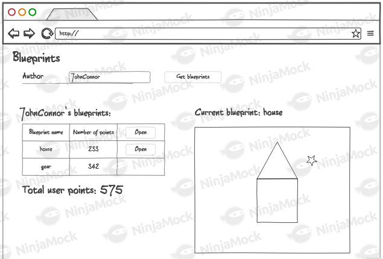

* Al oprimir 'Get blueprints', consulta los planos del usuario dado en el formulario. Por ahora, si la consulta genera un error, sencillamente no se mostrará nada.
* Al hacer una consulta exitosa, se debe mostrar un mensaje que incluya el nombre del autor, y una tabla con: el nombre de cada plano de autor, el número de puntos del mismo, y un botón para abrirlo.
* Al seleccionar uno de los planos, se debe mostrar el dibujo del mismo. Por ahora, el dibujo será simplemente una secuencia de segmentos de recta realizada en el mismo orden en el que vengan los puntos.

---

## Ajustes Backend

1. Trabaje sobre la base del proyecto anterior (en el que se hizo la API REST).
2. Incluya dentro de las dependencias de Maven los 'webjars' de jQuery y Bootstrap (esto permite tener localmente dichas librerías de JavaScript al momento de construir el proyecto):

    ```xml
    <dependency>
        <groupId>org.webjars</groupId>
        <artifactId>webjars-locator</artifactId>
    </dependency>

    <dependency>
        <groupId>org.webjars</groupId>
        <artifactId>bootstrap</artifactId>
        <version>3.3.7</version>
    </dependency>

    <dependency>
        <groupId>org.webjars</groupId>
        <artifactId>jquery</artifactId>
        <version>3.1.0</version>
    </dependency>                
    ```

---

## Front-End - Vistas

1. Cree el directorio donde residirá la aplicación JavaScript. Como se está usando SpringBoot, la ruta para poner en el mismo contenido estático (páginas Web estáticas, aplicaciones HTML5/JS, etc.) es:

    ```
    src/main/resources/static
    ```
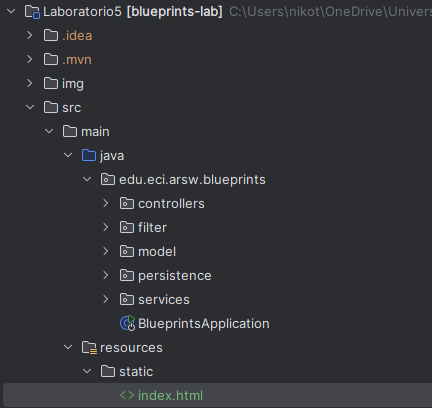


2. Cree, en el directorio anterior, la página index.html, sólo con lo básico: título, campo para la captura del autor, botón de 'Get blueprints', campo `<div>` donde se mostrará el nombre del autor y la tabla de planos.

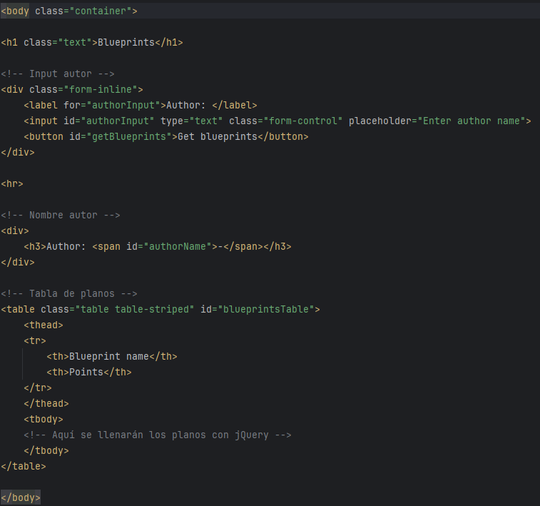

3. En el elemento `<head>` de la página, agregue las referencia a las librerías de jQuery, Bootstrap y a la hoja de estilos de Bootstrap.

    ```html
    <head>
        <title>Blueprints</title>
        <meta charset="UTF-8">
        <meta name="viewport" content="width=device-width, initial-scale=1.0">

        <script src="/webjars/jquery/jquery.min.js"></script>
        <script src="/webjars/bootstrap/3.3.7/js/bootstrap.min.js"></script>
        <link rel="stylesheet"
          href="/webjars/bootstrap/3.3.7/css/bootstrap.min.css" />
    </head>
    ```

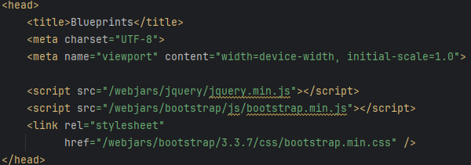

4. Suba la aplicación (`mvn spring-boot:run`), y rectifique:
	1. Que la página sea accesible desde:
    ```
    http://localhost:8080/index.html
    ```
	2. Al abrir la consola de desarrollador del navegador, NO deben aparecer mensajes de error 404 (es decir, que las librerías de JavaScript se cargaron correctamente).

---

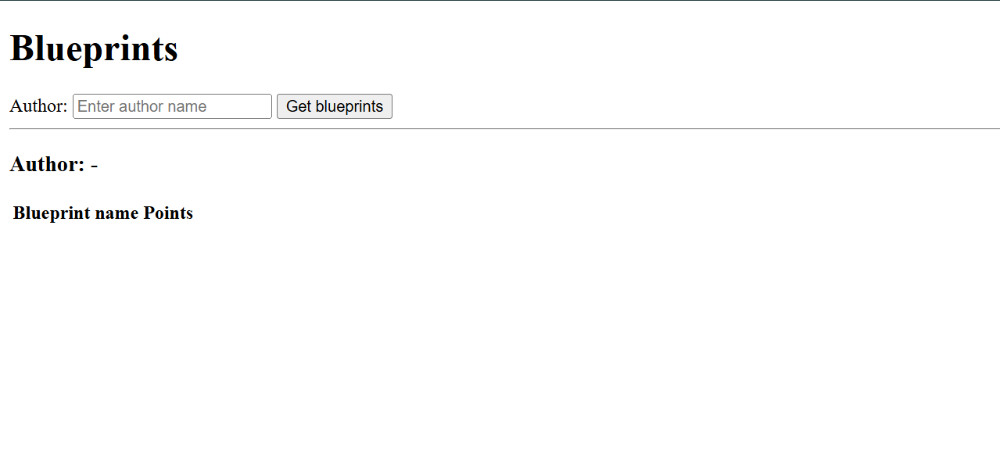

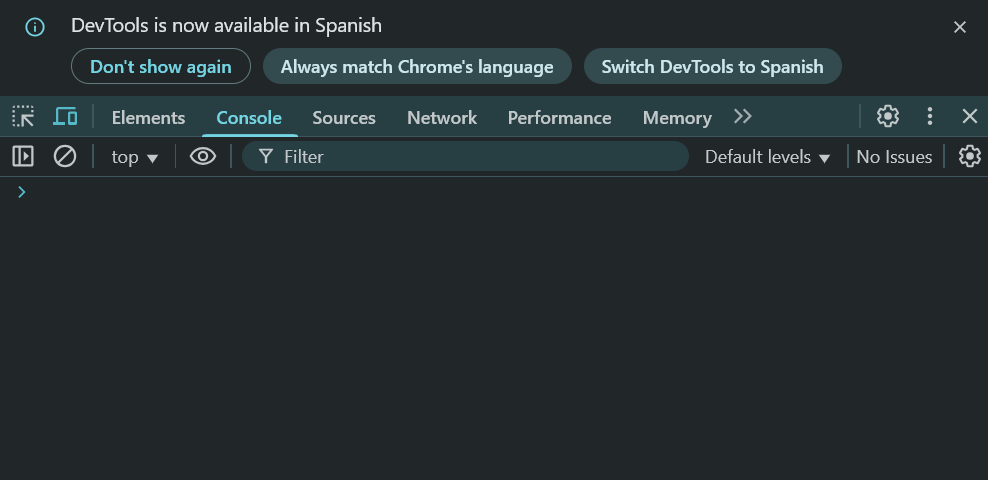

## Front-End - Lógica

1. Ahora, va a crear un Módulo JavaScript que, a manera de controlador, mantenga los estados y ofrezca las operaciones requeridas por la vista. Para esto tenga en cuenta el [patrón Módulo de JavaScript](https://addyosmani.com/resources/essentialjsdesignpatterns/book/#modulepatternjavascript).

2. Copie el módulo provisto (`apimock.js`) en la misma ruta del módulo antes creado. En éste agréguele más planos (con más puntos) a los autores 'quemados' en el código.

Se agregó más información a los autores que 'quemados'.
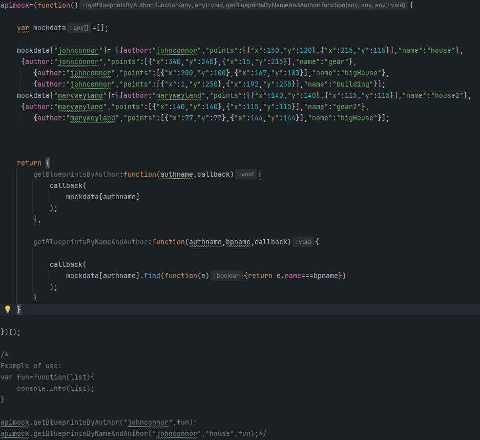

3. Agregue la importación de los dos nuevos módulos a la página HTML (después de las importaciones de las librerías de jQuery y Bootstrap):

    ```html
    <script src="js/apimock.js"></script>
    <script src="js/app.js"></script>
    ```
   
Se importan los correspondientes módulos en el orden correcto.

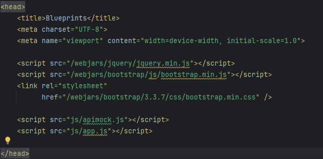

4. Haga que el módulo antes creado mantenga de forma privada:
	* El nombre del autor seleccionado.
	* El listado de nombre y tamaño de los planos del autor seleccionado. Es decir, una lista de objetos, donde cada objeto tendrá dos propiedades: nombre de plano, y número de puntos del plano.

   Junto con una operación pública que permita cambiar el nombre del autor actualmente seleccionado.

Se creó el módulo app.js con las respectivos requisitos

5. Agregue al módulo 'app.js' una operación pública que permita actualizar el listado de los planos, a partir del nombre de su autor (dado como parámetro). Para hacer esto, dicha operación debe invocar la función correspondiente en apimock.js.

	* Tome el listado de los planos, y le aplique una función 'map' que convierta sus elementos a objetos con sólo el nombre y el número de puntos.
	* Sobre el listado resultante, haga otro 'map', que tome cada uno de estos elementos, y a través de jQuery agregue un elemento `<tr>` (con los respectivos `<td>`) a la tabla creada en el punto 4.
	* Sobre cualquiera de los dos listados (el original, o el transformado mediante 'map'), aplique un 'reduce' que calcule el número de puntos. Con este valor, use jQuery para actualizar el campo correspondiente en la vista.

6. Asocie la operación antes creada (la de app.js) al evento 'on-click' del botón de consulta de la página.

7. Verifique el funcionamiento de la aplicación. Inicie el servidor, abra la aplicación HTML5/JavaScript, y rectifique que al ingresar un usuario existente, se cargue el listado del mismo.

Se prueba en localhost:8080 y se verifica el correcto funcionamiento.
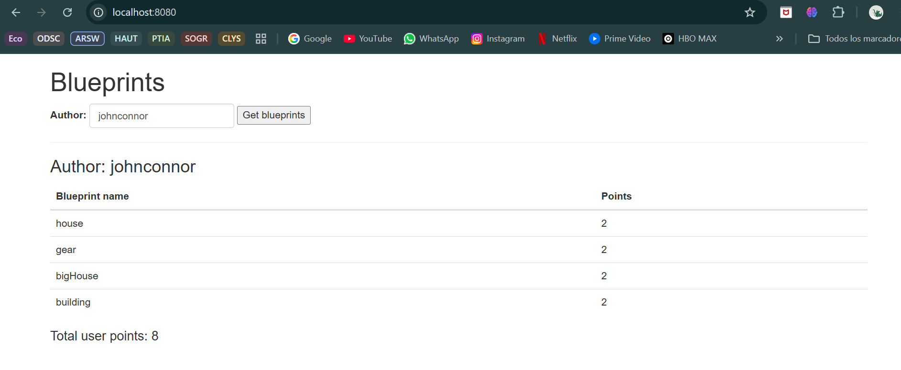

---

## Para la próxima semana

8. A la página, agregue un [elemento de tipo Canvas](https://www.w3schools.com/html/html5_canvas.asp), con su respectivo identificador. Haga que sus dimensiones no sean demasiado grandes para dejar espacio a los demás elementos de la página.

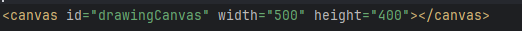

9. Al módulo app.js agregue una operación que, dado el nombre de un autor, y el nombre de uno de sus planos dados como parámetros, haciendo uso del método getBlueprintsByNameAndAuthor de apimock.js, consulte los puntos del plano correspondiente, y con los mismos dibuje consecutivamente segmentos de recta, haciendo uso [de los elementos HTML5 (Canvas, 2DContext, etc) disponibles](https://www.w3schools.com/html/html5_canvas.asp).

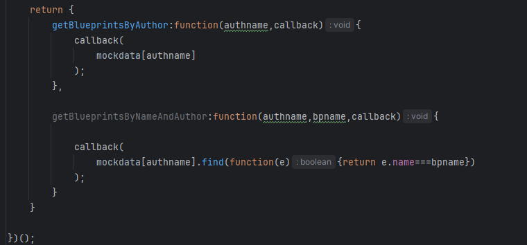

10. Verifique que la aplicación ahora, además de mostrar el listado de los planos de un autor, permita seleccionar uno de éstos y graficarlo. Para esto, haga que en las filas generadas para el punto anterior se agregue el botón de selección.

11. Verifique que la aplicación ahora permita: consultar los planos de un autor y graficar aquel que se seleccione.

Se cumple con la funcionalidad completa del ejercicio, permitiendo consultar planos de un autor y graficar el seleccionado.
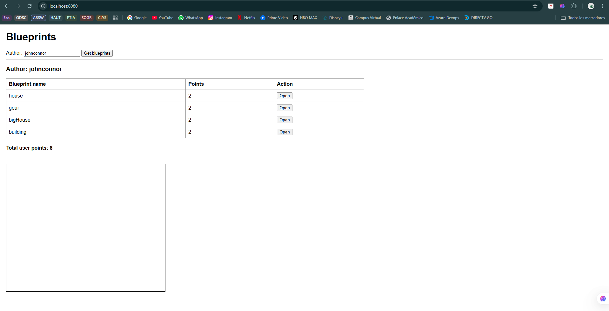

12. Una vez funcione la aplicación (sólo front-end), haga un módulo (llámelo 'apiclient') que tenga las mismas operaciones del 'apimock', pero que para las mismas use datos reales consultados del API REST.

Ya se verificó el correcto funcionamiento del front-end con el 'apimock', por lo que se modifica el api implementando 'apiclient.js' para se comunique directamente con el backend.

13. Modifique el código de app.js de manera que sea posible cambiar entre el 'apimock' y el 'apiclient' con sólo una línea de código.

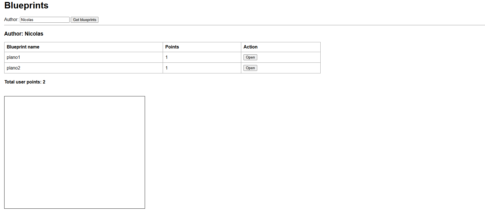

14. Revise la [documentación y ejemplos de los estilos de Bootstrap](https://v4-alpha.getbootstrap.com/examples/) (ya incluidos en el ejercicio), agregue los elementos necesarios a la página para que tenga una mejor presentación.